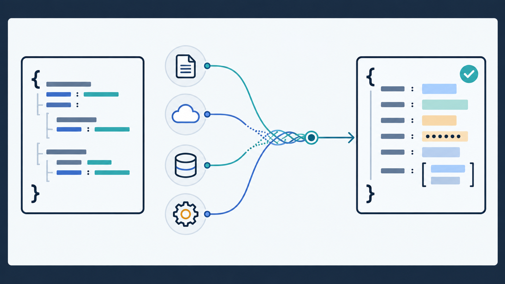
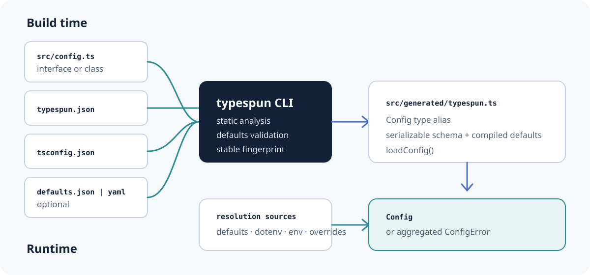

# Typespun

> Declare configuration once in TypeScript, then generate the loader.

[](https://github.com/omkar273/typespun/actions/workflows/ci.yml)
[](LICENSE)
[](package.json)
[](package.json)



Typespun turns one TypeScript interface or schema-only class into deterministic,
committable TypeScript that resolves and validates application configuration at
startup.

## The 30-second path

Declare a configuration root:

```ts
/** @typespun */
export interface AppConfig {
  server: { host: string; port: number };
  /** @secret */
  databaseUrl: string;
}
```

Configure and generate it:

```json
{
  "input": "src/config.ts",
  "output": "src/generated/typespun.ts",
  "envPrefix": "APP"
}
```

```json
{
  "scripts": {
    "config:generate": "typespun generate",
    "config:check": "typespun check"
  }
}
```

```sh
bun run config:generate
```

Load the generated, typed configuration:

```ts
import { loadConfig } from './generated/typespun.js';

const config = loadConfig({
  envFiles: [{ path: '.env', optional: true }],
});

console.log(config.server.port); // number
```

## Install

The package manifests are prepared for npm, but Typespun has not published its
first release yet. After that release:

```sh
bun add typespun
bun add --dev typespun-codegen
```

Equivalent installs are `npm install typespun && npm install --save-dev
typespun-codegen` or `pnpm add typespun && pnpm add --save-dev
typespun-codegen`. Today, clone this repository and run the included examples
with `bun install --frozen-lockfile`.

Supported engines are Bun 1.4.1 or newer and Node.js 22 or 24. CI exercises the
packed packages with Bun and both Node.js lines.

## Why Typespun?

Configuration often describes the same field three times: as a TypeScript type,
an environment parser, and a validation schema. Those copies drift. Typespun
uses the TypeScript declaration as the build-time source of truth and emits the
small runtime loader your application imports.

- Interfaces are concise; decorated classes offer literal defaults.
- Generated TypeScript is deterministic and intended for version control.
- Resolution order is fixed and visible.
- Missing and invalid values are reported together at startup.
- Fields marked secret omit received values from Typespun diagnostics.

## How it works



1. `typespun generate` loads `typespun.json` and the selected `tsconfig.json`.
2. The compiler finds exactly one exported `@typespun` interface or `@Config()`
   class and statically analyzes its fields.
3. Optional JSON/YAML defaults are validated and embedded.
4. A stable schema fingerprint and `loadConfig()` module are written atomically.
5. At runtime, `loadConfig()` selects the highest-precedence value for every
   field, coerces environment strings, and either returns `Config` or throws one
   `ConfigError`.

## Supported declarations

Typespun supports nested object shapes whose leaves are `string`, finite
`number`, `boolean`, string-literal unions or string enums, and arrays of
`string`, `number`, or `boolean`. Optional properties and optional object
branches are supported.

Use JSDoc on interfaces (`@typespun`, `@env`, `@key`, `@default`, `@secret`,
`@ignore`) or the corresponding inert decorators on classes (`Config`, `Env`,
`Key`, `Default`, `Secret`, `Ignore`). JavaScript schemas, nullable unions,
tuples, records/index signatures, dates, maps, sets, methods, computed fields,
and recursive shapes are not supported.

See [declarations](docs/concepts/declarations.md) and the
[annotation reference](docs/api/decorators-and-annotations.md).

## Source precedence

Highest precedence wins:

1. typed `overrides`
2. explicit `source`, or `process.env` when `source` is omitted
3. dotenv files, later entries over earlier entries
4. compiled JSON/YAML defaults
5. inline defaults

Passing `source: {}` deliberately disables the ambient `process.env` fallback.
Dotenv files are parsed without mutating `process.env`.

See [source precedence](docs/concepts/source-precedence.md).

## Generated code, validation, and secrets

Commit the generated module and run `bun run config:check` in CI. `check` does
not write files; it exits nonzero if output is missing or stale. Generation is
byte-stable for the same schema, project settings, defaults, and generator
version.

Runtime errors are aggregated in `ConfigError.issues`. For a secret field, an
invalid-value issue includes the path and environment key but excludes the
received value and type-specific details that could reveal allowed secrets.
Typespun cannot redact values logged by your application or another library,
and generated defaults are committed—do not place secrets there.

Read [generated code](docs/concepts/generated-code.md) and
[validation and redaction](docs/concepts/validation-and-redaction.md).

## Compatibility and maturity

The `typespun` runtime is configured with ESM and CommonJS entry points. Generated `.ts`,
`.mts`, and `.cts` modules use import specifiers derived from the selected
TypeScript module settings. The `typespun-codegen` package and CLI are ESM.

Typespun is pre-release software at version `0.1.0`; its packages are not yet on
npm. The current scope is intentionally narrow: synchronous environment,
dotenv, defaults-file, and override resolution; one configuration root per
project; no provider plugin system or runtime JSON/YAML source.

## Documentation

- [Getting started](docs/getting-started.md)
- [Runtime API](docs/api/runtime.md)
- [Generated loader API](docs/api/generated-loader.md)
- [CLI reference](docs/api/cli.md)
- [`typespun.json` reference](docs/reference/configuration.md)
- [Runnable interface example](examples/interface)
- [Runnable class example](examples/class)

## Project

- Contributions: [CONTRIBUTING.md](CONTRIBUTING.md)
- Support: [SUPPORT.md](SUPPORT.md)
- Security reports: [SECURITY.md](SECURITY.md)
- Code of Conduct: [CODE_OF_CONDUCT.md](CODE_OF_CONDUCT.md)
- License: [MIT](LICENSE)
