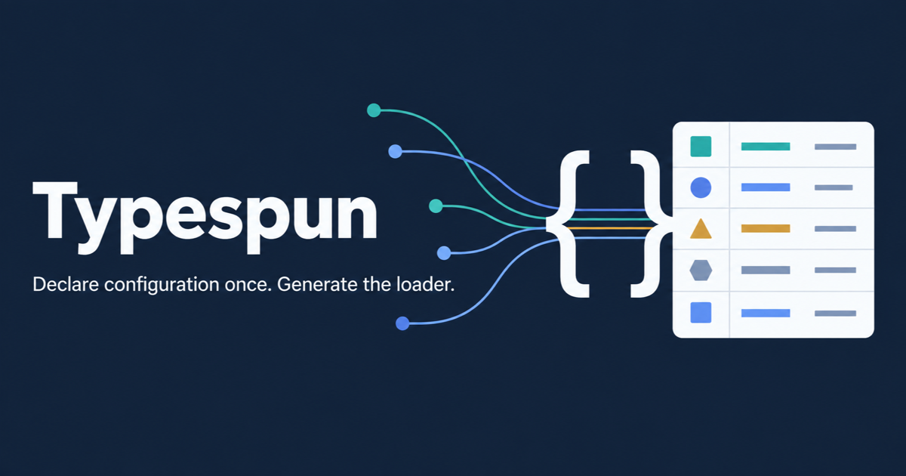

<p align="center">
  
</p>

# Typespun — typed configuration for TypeScript

> Declare configuration once in TypeScript. Generate the validated loader.

[](https://www.npmjs.com/package/typespun)
[](https://www.npmjs.com/package/typespun)
[](https://github.com/omkar273/typespun/actions/workflows/ci.yml)
[](LICENSE)
[](package.json)
[](package.json)



A configuration field is usually described three times — as a TypeScript type, as
`process.env` parsing, and as a runtime validation schema — and the three drift.
Typespun makes one TypeScript declaration the build-time source of truth and emits
a deterministic, committable loader that resolves sources in a fixed order and
validates every field at startup. Fields marked secret omit their received values
from Typespun's own diagnostics.

## Install

```sh
bun  add typespun && bun add --dev typespun-codegen
npm  install typespun && npm install --save-dev typespun-codegen
pnpm add typespun && pnpm add --save-dev typespun-codegen
```

Supported engines are Bun 1.4.1 or newer and Node.js 22 or newer. CI exercises the
packed packages on Bun 1.4.1 and Node.js 22, 24, and 26.

## 30-second example

Scaffold with `bun typespun init --env-prefix APP`, then declare configuration once:

```ts
// src/config.ts
/** @typespun */
export interface AppConfig {
  server: { host: string; port: number };
  origins: string[];
  /** @env DATABASE_URL */
  databaseUrl?: string;
}
```

`bun run config:generate` writes the loader you commit (excerpt):

```ts
// src/generated/typespun.ts — generated by typespun-codegen. Do not edit.
import { createLoader, type GeneratedSchema } from 'typespun/generated';
import type { AppConfig as TypespunConfig } from '../config.js';

export type Config = TypespunConfig;

const schema = {
  /* fingerprint, compiled defaults, per-field env keys (APP_SERVER_PORT, …) */
} as const satisfies GeneratedSchema;

export const loadConfig = createLoader<Config>(schema);
```

Application code imports it and gets a typed object, or one aggregated
`ConfigError` listing every problem at once:

```ts
// src/index.ts
import { loadConfig } from './generated/typespun.js';

const config = loadConfig({
  envFiles: [{ path: '.env', optional: true }],
  source: process.env,
  overrides: { server: { port: 4000 } },
});

console.log(`Listening on ${config.server.host}:${config.server.port}`);
```

The full walkthrough with exact console output is in
[getting started](docs/getting-started.md); this runs as [`examples/interface`](examples/interface).

## Why Typespun?

- **One declaration, no drift.** The interface or decorated class _is_ the schema.
- **Five sources, one documented order.** Most env libraries validate a single
  source; Typespun resolves each leaf independently across all five.
- **Deterministic, reviewable output.** Generation is byte-stable for the same
  inputs, so the loader belongs in version control and `config:check` fails CI
  when it goes stale. See [generated code](docs/concepts/generated-code.md).
- **Secret-aware diagnostics.** An invalid `@secret` field reports its path and
  environment key without the received value or type-specific detail — redaction
  inside Typespun's own errors, not encryption, and no protection from your
  application's logs.
- **When _not_ to use it.** If you need custom transforms, dynamic or
  runtime-fetched schemas, async secret providers, or a broad validation
  ecosystem, use a schema library instead. Typespun's model is deliberately small
  and asks you to accept a build step and committed output.

## Source precedence

Each leaf takes the highest-precedence value that is defined:

1. typed `overrides`
2. explicit `source`, or `process.env` when `source` is omitted
3. dotenv files, later entries over earlier entries
4. compiled JSON/YAML defaults
5. inline defaults

Passing `source: {}` deliberately disables the ambient `process.env` fallback, and
dotenv files are parsed without mutating `process.env`. See
[source precedence](docs/concepts/source-precedence.md).

## Supported declarations and limitations

Leaves may be `string`, finite `number`, `boolean`, string-literal unions or string
enums, and arrays of those primitives, nested in object shapes with optional
properties and optional branches. Annotate with JSDoc on interfaces (`@typespun`,
`@env`, `@key`, `@default`, `@secret`, `@ignore`) or the matching inert decorators
on classes (`Config`, `Env`, `Key`, `Default`, `Secret`, `Ignore`).

**Not supported:** JavaScript schemas, nullable unions, tuples, records and index
signatures, dates, maps, sets, methods, computed fields, and recursive shapes.
There is no plugin system, no asynchronous source and no runtime JSON/YAML
loading, and a project has exactly one configuration root. Unsupported constructs
fail generation rather than degrading silently. See
[declarations](docs/concepts/declarations.md) and the
[annotation reference](docs/api/decorators-and-annotations.md).

## Documentation

- [Getting started](docs/getting-started.md)
- [Generated code](docs/concepts/generated-code.md) · [Validation and redaction](docs/concepts/validation-and-redaction.md)
- [Runtime API](docs/api/runtime.md) · [Generated loader API](docs/api/generated-loader.md)
- [CLI reference](docs/api/cli.md) · [`typespun.json` reference](docs/reference/configuration.md)
- Runnable examples: [interface](examples/interface) · [class](examples/class)

## Compare to other approaches

Manual parsing, schema-first runtime validation, TypeScript-only typing, and
Typespun each trade something different. The
[honest approach comparison](docs/launch/marketing-kit.md#honest-approach-comparison)
sets out the source of truth, runtime dependency, strength, and cost of each —
including where Typespun is the wrong choice.

## Project

Typespun is pre-1.0; `typespun` and `typespun-codegen` are versioned and released
together, so pin both during early adoption. See [CHANGELOG.md](CHANGELOG.md).

- Contributions: [CONTRIBUTING.md](CONTRIBUTING.md)
- Support: [SUPPORT.md](SUPPORT.md)
- Security reports: [SECURITY.md](SECURITY.md)
- Code of Conduct: [CODE_OF_CONDUCT.md](CODE_OF_CONDUCT.md)
- License: [MIT](LICENSE)
