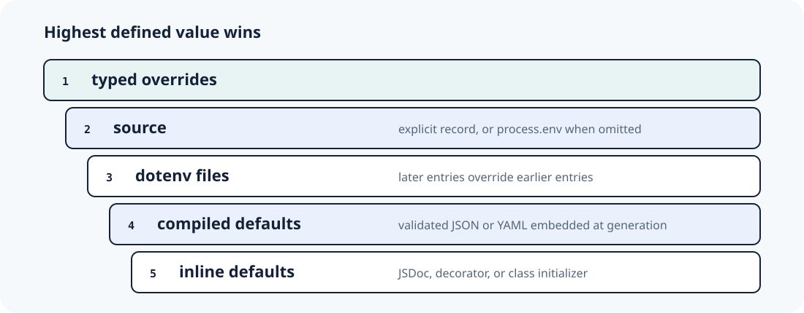

# Source precedence

Typespun resolves each leaf independently. It selects the highest-precedence
defined candidate before coercion, so an invalid lower source cannot break a
valid higher source.



Text equivalent, highest to lowest:

1. typed `overrides`
2. explicit `source`; if omitted, ambient `process.env`
3. dotenv files, with later array entries winning
4. compiled JSON/YAML defaults
5. inline declaration defaults

```ts
const config = loadConfig({
  envFiles: ['.env', '.env.local'],
  source: process.env,
  overrides: { server: { port: 5000 } },
});
```

Here the override wins for `server.port`; `process.env` wins for other keys it
defines; `.env.local` wins over `.env`; then compiled and inline defaults fill
remaining leaves.

`undefined` means “no candidate.” An empty string is a candidate and is
validated for its field type. `source: {}` disables ambient environment input.
Empty override objects are merge no-ops; unknown or cyclic override paths are
reported as issues.
